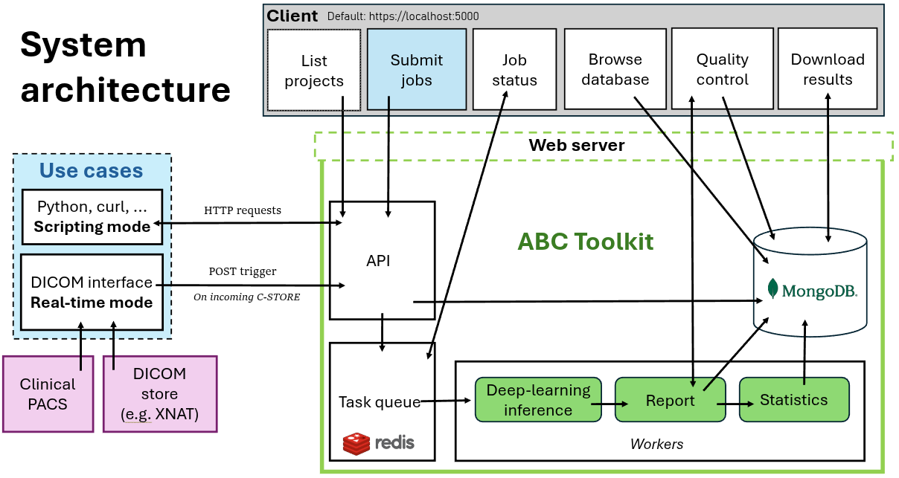

# Automatic Body Composition (ABC) toolkit


[**Paper**]() | [**Getting started**](#getting_started) | [**Using ABC**](#using_abc)  | [**Contribute**](#contribute) | [**Citation**](#citation)


## Introduction
The *Automatic Body Composition (ABC) toolkit* is a web-app for large-scale analyses of body composition from medical images.

Several segmentation models are available, spanning from neck to thigh. Most models were developed to analyse CT scans but others work on MR (male pelvis) and cone-beam CT images (at C3). A full list of models is available [here](#available_models). Feel free to add your own models (this may or may not be straightforward...).


## Requirements
- [Docker](https://www.docker.com/get-started/). [Here](https://docs.docker.com/engine/install/ubuntu/) is a useful guide for Ubuntu.
- [nvidia-container-toolkit](https://docs.nvidia.com/datacenter/cloud-native/container-toolkit/latest/install-guide.html). GPU is only needed for vertebral labelling; segmentation is performed by the CPU. Vertebral labelling can be bypassed (see **here**).

On Windows, [Windows Subsystem for Linux](https://learn.microsoft.com/en-us/windows/wsl/install) is recommended. This isn't required but ABC hasn't been tested without it and the commands below will be slightly different.

On Linux distributions, you will need to add the current user to the `docker` group with `sudo usermod -a -G docker USERNAME`.

## Getting started
<a name="getting_started"></a>

``` bash
$ git clone git@github.com:DMcSweeney/ABC-toolkit.git && cd ABC-toolkit
$ cp .env-default .env 
$ # EDIT .env; 
$ docker compose up
```

### .env variables
! -- TODO

## Basic Usage

Below is a basic python script for submitting jobs to the toolkit. 
This assumes `INPUT_DIR =/data/data_for_my_first_project/` and `BACKEND_PORT=5001`.

``` python
"""
Example script for submitting jobs to the toolkit
"""
import os
import requests

## ABC config
host_ip = 'localhost'
spine_url = f'https://{host_ip}:5001/api/jobs/infer/spine'
segment_url = f'https://{host_ip}:5001/api/jobs/infer/segment'

## DATA config
input_dir = "/data/data_for_my_first_project/"
project = 'my_first_project'

def main():
    contents = []

    ## Create all the requests.
    ## This example assumes you have one image per patient and each patient is a folder in input_dir
    for patient in os.listdir(input_dir):
        ## THIS changes depending on how you have defined INPUT_DIR in your .env file
        ## The path provided in the request needs to be the path as seen inside the toolkit (i.e. always starts with /data/inputs/)
        path_in_abc = input_dir.replace('/data/data_for_my_first_project/', '/data/inputs/')
        patient_path = os.path.join(path_in_abc, patient)
        
        ## Create request bodies
        ## You can add other arguments here as needed - see docs for details
        ## In this example, we submit a spine labelling job followed by a segmentation job for L3 +/- 1 slice (i.e. 3 slices in total)
        spine_body = {"input_path": patient_path, "project": project, "patient_id": patient}
        segment_body = {"input_path": patient_path, "project": project, "patient_id": patient, "vertebra": 'L3', "num_slices": "1"}
        data = {'spine': spine_body, 'segment': segment_body}
        contents.append(data)

    ## Submit jobs
    for x in contents:
        print(f'Request: {x}')
        # Submit spine labelling job
        res = requests.post(spine_url, json=x['spine'], verify=False)
        x['segment']['depends_on'] = res.json()['job-ID'] ## Update segment job with the job id 
        res = requests.post(segment_url, json=x['segment'], verify=False) ## Submit segment job

if __name__ == '__main__':
    main()

```


## System Architecture
Need an explanation of the system architecture.
What endpoint point to what, where things can be found, etc...



### Available segmentation models  <a name="available_models"></a>


Add your own models by updating `backend/src/abcTK/segment/model_bank.py`. 
**Note:** you will likely need to update post-processing and pre-processing `backend/src/abcTK/segment/engine.py`

| Modality | Vertebral Level |body|  skeletal_muscle | subcutaneous_fat| visceral_fat|
|----------|-----------------|----|------------------|-----------------|-------------|
|CT |C3| :white_check_mark: | :white_check_mark:| | |
|CBCT |C3|  :white_check_mark: | :white_check_mark:| | |
|CT |T4|  :white_check_mark: | :white_check_mark:| | |
|CT |T9|  :white_check_mark: | :white_check_mark:| | |
|CT |T12|  :white_check_mark: | :white_check_mark:| | |
|Screening CT |T12| | :white_check_mark:| | |
|CT |L3| | :white_check_mark: |:white_check_mark: |:white_check_mark: |
|CT |L5| | :white_check_mark: |:white_check_mark: |:white_check_mark: |
|Sacrum |T2 MRI| | :white_check_mark: |:white_check_mark: ||
|Thigh |CT| | :white_check_mark: | ||

## Contribute <a name="contribute"></a>
Feedback is appreciated, please open a new issue if you have any issues or suggestions. For code modifications, open a new pull request.