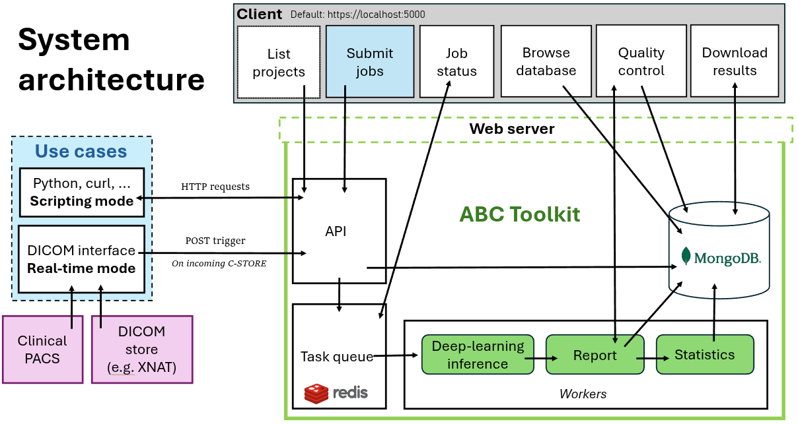

# Automatic Body Composition (ABC) toolkit


[**Paper**]() | [**Getting started**](#getting_started) | [**Using ABC**](#using_abc) | [**API Reference**](api-reference.md) | [**Contribute**](#contribute) | [**Citation**](#citation)


## Introduction
The *Automatic Body Composition (ABC) toolkit* is a web-app for large-scale analyses of body composition from medical images.

Several segmentation models are available, spanning from neck to thigh. Most models were developed to analyse CT scans but others work on MR (male pelvis) and cone-beam CT images (at C3). A full list of models is available [here](#available_models). Feel free to add your own models (this may or may not be straightforward...).


## Requirements
- [Docker](https://www.docker.com/get-started/). [Here](https://docs.docker.com/engine/install/ubuntu/) is a useful guide for Ubuntu.
- [nvidia-container-toolkit](https://docs.nvidia.com/datacenter/cloud-native/container-toolkit/latest/install-guide.html). GPU is only needed for vertebral labelling; segmentation is performed by the CPU. To skip vertebral labelling (and the GPU requirement) entirely, don't call `/api/jobs/infer/spine` — pass `slice_number` explicitly to `/api/jobs/infer/segment` instead, which is otherwise looked up from a prior labelling job. See [`slice_number` in the API Reference](api-reference.md#jobs--apijobs).

On Windows, [Windows Subsystem for Linux](https://learn.microsoft.com/en-us/windows/wsl/install) is recommended. This isn't required but ABC hasn't been tested without it and the commands below will be slightly different.

On Linux distributions, you will need to add the current user to the `docker` group with `sudo usermod -a -G docker USERNAME`.

## Getting started
<a name="getting_started"></a>

``` bash
$ git clone git@github.com:DMcSweeney/ABC-toolkit.git && cd ABC-toolkit
$ cp .env-default .env 
$ # EDIT .env; 
$ docker compose up
```

### .env variables
Every variable is documented inline in [.env-default](https://github.com/DMcSweeney/ABC-Toolkit/blob/master/.env-default) — copy it to `.env` and read the comments before changing anything. The two you're most likely to need to touch:
- **`HOST_IP`**: defaults to `localhost`, which only works if you're opening the frontend on the same machine running `docker compose`. Set it to that machine's real IP/hostname for a remote/server deployment.
- **`INPUT_DIR` / `OUTPUT_DIR`**: host folders mounted into the containers as `/data/inputs` and `/data/outputs`. See [Using ABC](#using_abc) below for how host paths map to the `/data/inputs/...` paths your requests actually use.

Everything else (ports, Mongo credentials, `FLASK_DEBUG`) has a working default for local/single-machine use — change the credentials before deploying anywhere the Mongo or mongo-express ports might be reachable by anyone else.

## Using ABC
<a name="using_abc"></a>

Tasks are performed by making HTTP requests to the backend — see the [**API Reference**](api-reference.md) for every endpoint, or [examples/api/](https://github.com/DMcSweeney/ABC-Toolkit/tree/master/examples/api) and [examples/python/](https://github.com/DMcSweeney/ABC-Toolkit/tree/master/examples/python) for runnable examples. The frontend's **Submit Jobs** page (`/submit_job`) also covers the common case directly — either one scan at a time, or a CSV batch of scans — if you'd rather not script it.

> **Important:** every request that references a scan (`input_path` and similar) must use the path **as seen inside the container**, i.e. starting with `/data/inputs/...` — not the path on your host machine. `INPUT_DIR`/`OUTPUT_DIR` in `.env` control what host folder gets mounted to `/data/inputs`/`/data/outputs`, but requests always address files by their in-container path. The script below shows this mapping in practice.

Below is a basic python script for submitting jobs to the toolkit. 
This assumes `INPUT_DIR =/data/data_for_my_first_project/` and `BACKEND_PORT=5001`.

``` python
"""
Example script for submitting jobs to the toolkit
"""
import os
import requests

## ABC config
host_ip = 'localhost'
spine_url = f'https://{host_ip}:5001/api/jobs/infer/spine'
segment_url = f'https://{host_ip}:5001/api/jobs/infer/segment'

## DATA config
input_dir = "/data/data_for_my_first_project/"
project = 'my_first_project'

def main():
    contents = []

    ## Create all the requests.
    ## This example assumes you have one image per patient and each patient is a folder in input_dir
    for patient in os.listdir(input_dir):
        ## THIS changes depending on how you have defined INPUT_DIR in your .env file
        ## The path provided in the request needs to be the path as seen inside the toolkit (i.e. always starts with /data/inputs/)
        path_in_abc = input_dir.replace('/data/data_for_my_first_project/', '/data/inputs/')
        patient_path = os.path.join(path_in_abc, patient)
        
        ## Create request bodies
        ## You can add other arguments here as needed - see docs for details
        ## In this example, we submit a spine labelling job followed by a segmentation job for L3 +/- 1 slice (i.e. 3 slices in total)
        spine_body = {"input_path": patient_path, "project": project, "patient_id": patient}
        segment_body = {"input_path": patient_path, "project": project, "patient_id": patient, "vertebra": 'L3', "num_slices": "1"}
        data = {'spine': spine_body, 'segment': segment_body}
        contents.append(data)

    ## Submit jobs
    for x in contents:
        print(f'Request: {x}')
        # Submit spine labelling job
        res = requests.post(spine_url, json=x['spine'], verify=False)
        x['segment']['depends_on'] = res.json()['job-ID'] ## Update segment job with the job id 
        res = requests.post(segment_url, json=x['segment'], verify=False) ## Submit segment job

if __name__ == '__main__':
    main()

```


## System Architecture



There are two ways to get images into ABC (left side of the diagram, blue box): **scripting mode**, where you (or a script) send HTTP requests directly — the `curl`/Python examples throughout this page — or **real-time mode**, where a clinical PACS or DICOM store sends images straight to the built-in Conquest DICOM server, which POSTs a trigger to the backend as each series arrives (`/api/conquest/handle_trigger`, invoked automatically — you don't call this yourself).

The **Client** box is the Vue frontend (default `https://localhost:5000`). 

For the full set of endpoints behind each of these, see the [**API Reference**](api-reference.md).

### Available segmentation models  <a name="available_models"></a>


Add your own models by updating `backend/src/abcTK/segment/model_bank.py`. 
**Note:** you will likely need to update post-processing and pre-processing `backend/src/abcTK/segment/engine.py`

| Modality | Vertebral Level |body|  skeletal_muscle | subcutaneous_fat| visceral_fat|
|----------|-----------------|----|------------------|-----------------|-------------|
|CT |C3| :white_check_mark: | :white_check_mark:| | |
|CBCT |C3|  :white_check_mark: | :white_check_mark:| | |
|CT |T4|  :white_check_mark: | :white_check_mark:| | |
|CT |T9|  :white_check_mark: | :white_check_mark:| | |
|CT |T12|  :white_check_mark: | :white_check_mark:| | |
|Screening CT |T12| | :white_check_mark:| | |
|CT |L3| | :white_check_mark: |:white_check_mark: |:white_check_mark: |
|CT |L5| | :white_check_mark: |:white_check_mark: |:white_check_mark: |
|Sacrum |T2 MRI| | :white_check_mark: |:white_check_mark: ||
|Thigh |CT| | :white_check_mark: | ||

## Contribute <a name="contribute"></a>
Feedback is appreciated, please open a new issue if you have any issues or suggestions. For code modifications, open a new pull request.